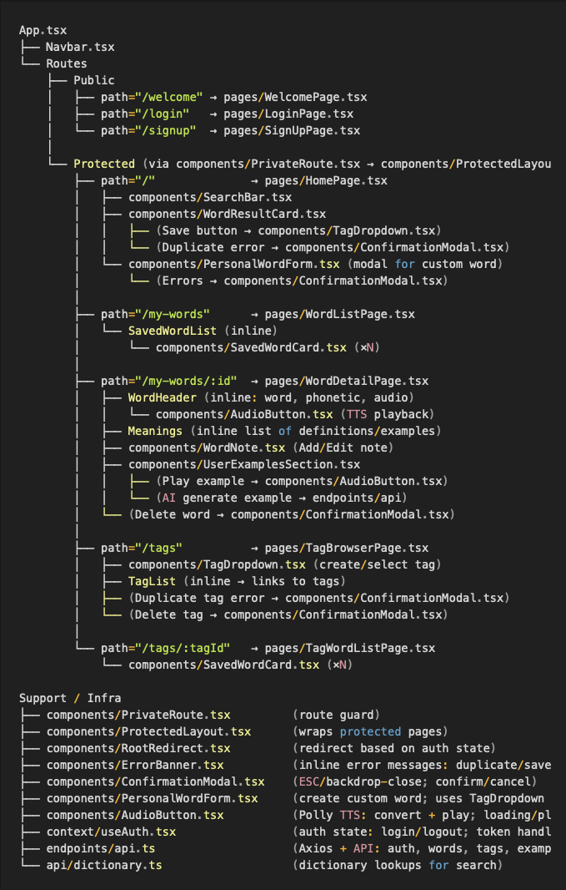
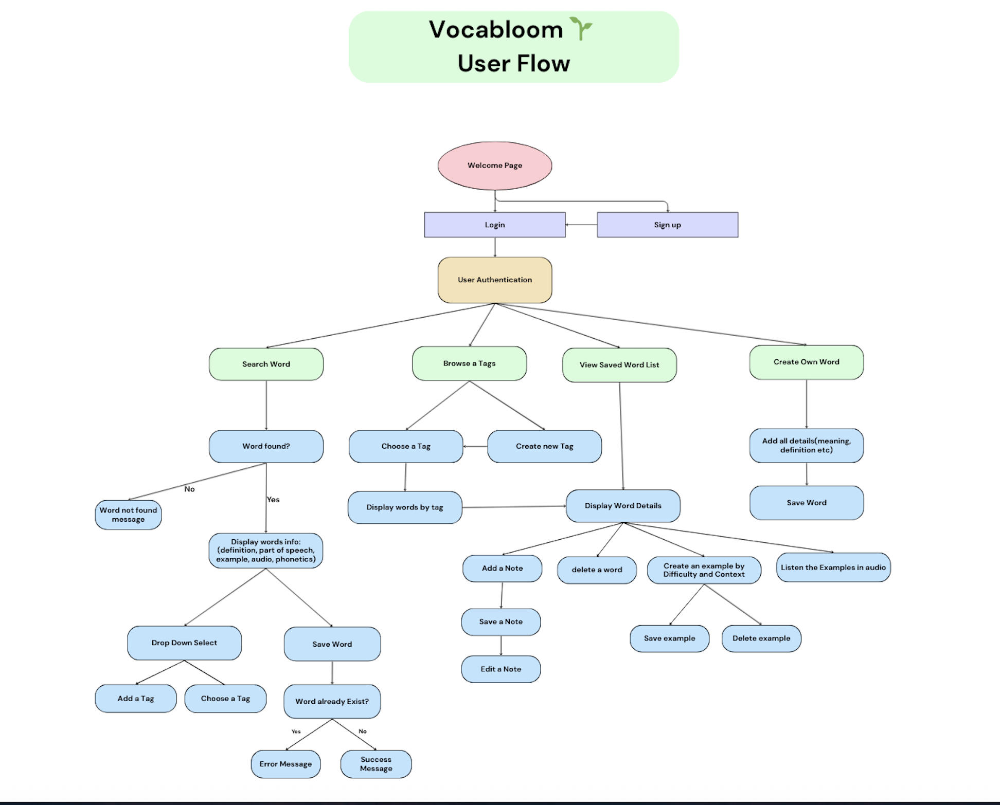
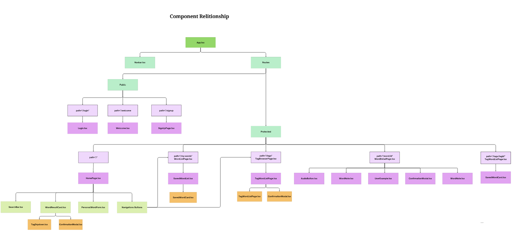

# Vocabloom Frontend - Components, Structure & Flow

## Visual Map - Routes & Components

## User Flow

## Component Relationship Diagram

### **api/**

Handles API calls to backend services.

- `dictionary.ts` — Functions to fetch word definitions and related data from the backend API.
- `__tests__/dictionary.test.ts` — Unit tests for dictionary API calls.

---

### **components/**

Reusable UI elements used across multiple pages.

- **Navbar** — Top navigation bar for logged-in and logged-out states.
- **private_route.tsx** — Higher-order component to protect routes for authenticated users only.
- **ProtectedLayout.tsx** — Layout wrapper for protected pages.
- **RootRedirect.tsx** — Redirects users based on authentication status.
- **SavedWordCard.tsx** — Displays a saved word in a list.
- **SearchBar.tsx** — Input + button to search words.
- **TagDropdown.tsx** — Dropdown menu for selecting or creating tags.
- **WordNote.tsx** — Component to add, edit, or delete personal notes for a word.
- **WordResultCard.tsx** — Displays details of a searched word (definition, phonetic, audio).
- All `.test.tsx` files — Jest/RTL unit tests for their matching components.

---

### **context/**

Holds React Context providers and hooks.

- **useAuth.tsx** — Custom hook for authentication state and actions (login, logout, check session).
- **tests/useAuth.test.tsx** — Tests authentication context logic.

---

### **endpoints/**

Centralized API request functions.

- **api.ts** — Axios instance and wrapper functions for authentication, word saving, and tagging.
- **tests/api.test.tsx** — Unit tests for API calls.

---

### **pages/**

Full page components for each route in the app.

- **HomePage** — Search interface for words.
- **LoginPage** — User login form.
- **Logout** — Handles user logout and redirection.
- **SignUpPage** — Registration form for new users.
- **TagBrowserPage** — View all tags and browse words by tag.
- **TagWordListPage** — Displays all words under a specific tag.
- **WelcomePage** — Landing page for unauthenticated users.
- **WordDetailPage** — Detailed view of a saved word with notes.
- **WordListPage** — List of saved words.
- Each has a `.test.tsx` file for UI and functionality tests.

---

### **styles/**

CSS files for individual components and pages. Uses modular structure for maintainability.

---

### **types/**

Holds TypeScript interface definitions.

- **word.ts** — Defines `WordData`, `Meaning`, `Definition` interfaces for consistent typing.

---

### **Root Files**

- **App.tsx** — Main app component with routes.
- **App.css** — Global styles for App.
- **index.tsx** — React entry point, renders App.
- **index.css** — Global base styles.

---

## Testing

- All test files use **Jest + React Testing Library**.
- Coverage includes:
  - API call mocks (`api.test.tsx`, `dictionary.test.ts`)
  - Component rendering & user interactions
  - Route protection and redirects
  - Form input handling and validation

---

# Component Documentation

---

## **App.tsx**

**Purpose:** Main application entry point. Defines all routes and wraps them with the correct layouts (`Public`, `Protected`).

**How it works:**
1. Imports `Navbar`, `ProtectedLayout`, `PrivateRoute`, and all pages.
2. Uses `react-router-dom`’s `<Routes>` and `<Route>` to map paths.
3. Public routes → directly render pages.
4. Protected routes → wrapped in `<PrivateRoute>` inside `<ProtectedLayout>`.
5. Root path (`/`) uses `<RootRedirect>` to send user to `/home` or `/welcome`.

---

## **Navbar.tsx**

**Purpose:** Top navigation bar for authenticated users. Displays app title, links, and logout button.

**State:** None (relies on `useAuth` context).

**How it works:**
1. Shows title as link to `/`.
2. Includes **Home** link and **Log out** button.
3. `handleLogout()` calls `logout()` from API, sets `isAuthenticated` to false, and redirects to `/welcome`.

---

## **PrivateRoute.tsx**

**Purpose:** Protect routes from unauthenticated access.

**Props:**
- `children: React.ReactElement` — component to render if authenticated.

**How it works:**
1. Gets `isAuthenticated` and `loading` from `useAuth`.
2. If loading → show `"Loading..."`.
3. If authenticated → render children.
4. Else → redirect to `/welcome`.

---

## **ProtectedLayout.tsx**

**Purpose:** Layout wrapper for protected pages.

**How it works:**
1. Always renders `<Navbar>`.
2. Uses `<Outlet />` to render child routes inside.

---

## **RootRedirect.tsx**

**Purpose:** Redirect user based on authentication state.

**State:** `ready: boolean` — ensures small delay before redirect.

**How it works:**
1. Waits ~100ms to allow auth state load from storage/cookies.
2. If authenticated → redirect to `/home`.
3. Else → render `<WelcomePage>`.

---

## **HomePage.tsx**

**Purpose:** Main search and results view.

**State:**
- `query` — current search term.
- `results` — dictionary API results.
- `error` — error message for failed searches.

**How it works:**
1. Renders `<SearchBar>` for input.
2. On search → fetch from dictionary API.
3. Shows `<WordResultCard>` for results.
4. `<WordResultCard>` → includes "Save" button with `<TagDropdown>` to choose/create tag.

---

## **SearchBar.tsx**

**Purpose:** Reusable search input with button.

**Props:**
- `value` — input text.
- `onChange` — update value.
- `onSearch` — trigger search.

**How it works:**
1. Controlled input tied to `value`.
2. Button click or Enter key triggers `onSearch()`.

---

## **WordResultCard.tsx**

**Purpose:** Display a single search result.

**Props:**
- `data: WordData` — word info from API.
- `onSave` — callback when saving.
- `tags` — available tags.

**How it works:**
1. Displays word, phonetic, audio, and meanings.
2. Includes `<TagDropdown>` to select/create tag.
3. Save button → calls `onSave` with selected tag.

---

## **TagDropdown.tsx**

**Purpose:** Select an existing tag or create a new one.

**Props:**
- `onSelect(tagId, tagName)` — callback on selection.
- `tags` — current tag list.
- `setTags` — state setter for tags.

**How it works:**
1. Dropdown for existing tags.
2. Option to create a new tag → calls `create_tag()` API → adds to list.

---

## **WordListPage.tsx**

**Purpose:** List all saved words, optionally filtered by tag.

**State:**
- `words: WordData[]` — saved words.
- `tagName: string | null` — current tag name.
- `loading: boolean` — loading state.

**How it works:**
1. Reads `tagId` from URL query.
2. On mount / tag change:
   - Calls `get_saved_words()` → filters if tagId exists.
   - If tagId exists → fetch tag name from `get_tag_by_id()`.
3. Renders back button, title, and list.
4. Clicking a word → navigate to `/my-words/:id`.

---

## **SavedWordCard.tsx**

**Purpose:** Compact card view of a saved word in lists.

**Props:**
- `word: WordData` — word data.
- `onClick` — navigate to detail view.

**How it works:**
1. Shows word and icon.
2. Click triggers `onClick`.

---

## **WordDetailPage.tsx**

**Purpose:** View details for a saved word.

**State:**
- `word: WordData | null` — word details.
- `loading: boolean`.
- `notFound: boolean`.

**How it works:**
1. Reads `id` from route params.
2. Fetches `/words/:id/` → normalizes meanings.
3. Renders:
   - Word, phonetic, audio.
   - `<WordNote>` for personal note.
   - Definitions/examples.
4. Delete button → calls DELETE → back to `/my-words`.

---

## **WordNote.tsx**

**Purpose:** Add or edit a personal note for a saved word.

**Props:**
- `word: WordData`.
- `onUpdated(updatedWord)` — callback after saving.

**How it works:**
1. Textarea for note.
2. Save button → PATCH request to update note.

---

## **TagBrowserPage.tsx**

**Purpose:** Browse all tags, create new tags, and view words under a tag.

**State:**
- `tags: Tag[]`.
- `showInput: boolean`.
- `newTag: string`.

**How it works:**
1. On mount → calls `get_tags()`.
2. Click a tag → `/my-words?tagId=...&tagName=...`.
3. Add tag → `create_tag()` → append to list.
4. Back button → `navigate(-1)`.

---

## **TagWordListPage.tsx**

**Purpose:** Display words under a specific tag.

**State:**
- `words: WordData[]`.
- `notFound: boolean`.

**How it works:**
1. Reads `tagId` and `tagName` from URL query.
2. Fetches words for that tag.
3. Renders list or "No words" message.

---

## **WelcomePage.tsx**

**Purpose:** Public landing page.

**How it works:**
1. Displays app name and slogan.
2. Buttons: **Sign in** → `/login`, **Sign up** → `/signup`.
3. Footer credits.

---

## **LoginPage.tsx**

**Purpose:** Authenticate an existing user.

**State:**
- `username`, `password`.

**How it works:**
1. On submit → calls `login_user()` from `useAuth`.
2. If successful → navigate to `/home`.
3. Else → show error message.

---

## **useAuth.tsx**

**Purpose:** Global auth state & methods.

**State:**
- `isAuthenticated`, `loading`, `user`.

**How it works:**
- `login_user`, `logout`, `register_user`.
- Stores tokens in cookies.
- Exposes context for components.

---

## **api.ts**

**Purpose:** Centralized API calls to backend.

**Exports include:**
- Auth: `login_user`, `logout`, `register_user`.
- Words: `get_saved_words`, `get_word_by_id`, `create_word`, `delete_word`.
- Tags: `get_tags`, `create_tag`, `get_words_by_tag`, `get_tag_by_id`.

---

## **dictionary.ts**

**Purpose:** Fetch word data from external dictionary API.

**Exports:**
- `fetchWordData(word)` — returns definitions, phonetics, audio.

---

## ⚠️ **ConfirmationModal.tsx**

**Purpose:** Generic modal to confirm or acknowledge important actions.

**Props:**
- `isOpen: boolean` — controls visibility
- `title: string` — heading text
- `message: string` — body text
- `confirmText?: string` — confirm button label (default: `"Confirm"`)
- `cancelText?: string` — cancel button label (default: `"Cancel"`; pass `""` to hide)
- `onConfirm: () => void` — confirm handler
- `onCancel: () => void` — cancel/close handler
- `type?: 'warning' | 'danger' | 'info'` — visual style (default: `'warning'`)

**How it works:**
- Renders when `isOpen` is `true`; otherwise returns `null`.
- Closes on **ESC** key or **backdrop click**.
- Applies ARIA roles/labels for accessibility (`role="dialog"`, `aria-modal="true"`).

---

## 🧾 **PersonalWordForm.tsx**

**Purpose:** Create a fully custom word with phonetics, meanings/definitions, and an optional tag.

**Props:**
- `isOpen: boolean` — show/hide form in a modal
- `onClose: () => void` — close handler
- `onSave: (wordData: WordData & { tag: number | null }) => void` — submit handler (can throw for duplicates)
- `tags: { id: number; name: string }[]` — available tags
- `setTags: React.Dispatch<React.SetStateAction<Tag[]>>` — update tag list after creation

**How it works:**
- Resets form when closed; initializes with one meaning and one definition.
- Validates:
  - **Word** is required
  - Every **meaning** must have `partOfSpeech`
  - Every **definition** entry must have `definition`
- Lets users **add/remove meanings** and **add/remove definitions**.
- Uses `<TagDropdown>` for optional tag selection.
- On submit:
  - Builds a `WordData` object (with `tag`)
  - Calls `onSave(...)` and closes on success
  - On error, shows `<ConfirmationModal>`:
    - `"WORD_DUPLICATE"` → “This word already exists for this tag.”
    - `"TAG_DUPLICATE"` → “This tag already exists.”
    - Otherwise → “Couldn’t save. Please try again.”

**UI details:**
- Backdrop click closes the form.
- Header close button (`×`) also calls `onClose`.

---

## 🔊 **AudioButton.tsx**

**Purpose:** Convert text to speech (Amazon Polly via API) and play it with a single button.

**Props:**
- `text: string` — text to synthesize (required)
- `voiceId?: string` — Polly voice (default: `"Joanna"`)
- `className?: string` — optional extra classes
- `size?: number` — icon size (default: `24`)

**How it works:**
- Disables button while loading or when `text` is empty.
- On click:
  1. Calls `convertTextToSpeech(text, voiceId)` → returns `audioUrl`
  2. If URL exists → calls `playAudio(audioUrl)` and toggles **playing** state
  3. Handles errors (alerts user, logs to console)
- Icon states:
  - **Loading** → animated volume icon
  - **Playing** → fading volume high
  - **Idle** → volume low

**Notes:**
- Alerts if no text or if conversion/playback fails.
- Visual states controlled by `isLoading` and `isPlaying` classes.
